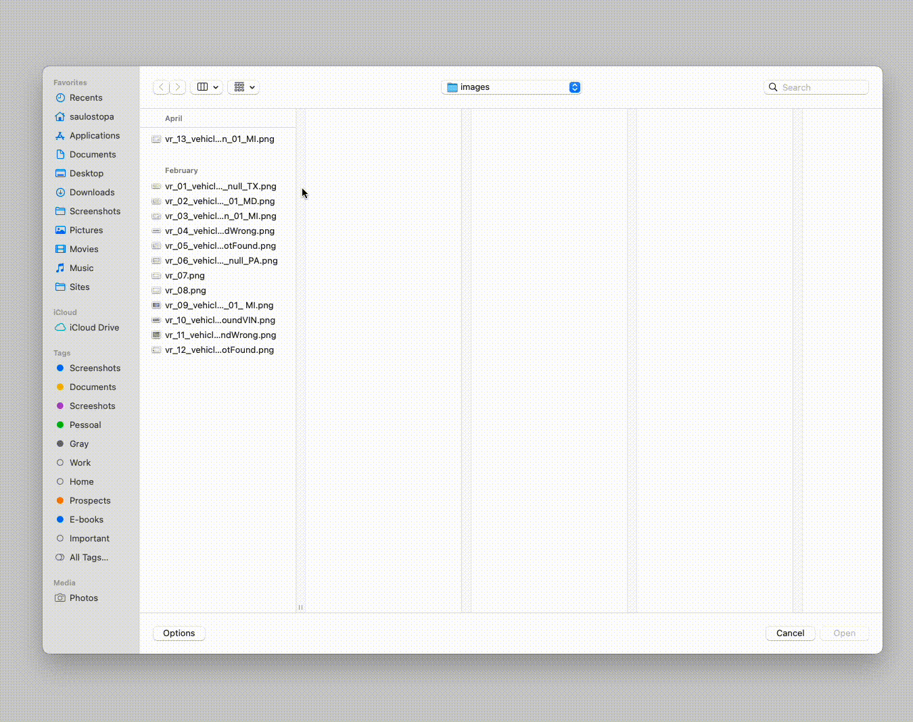
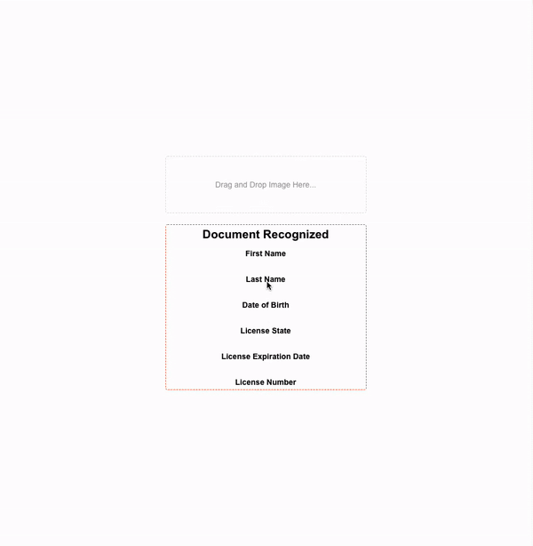
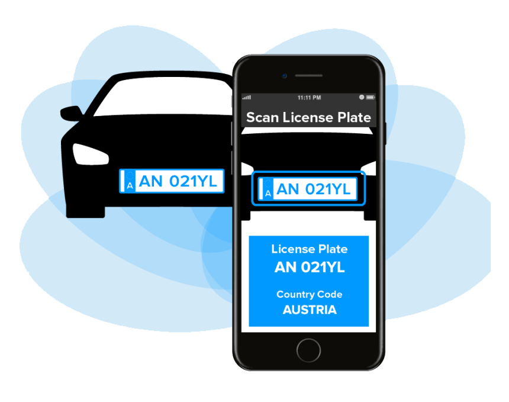

 

  <h1 align="center">WebApps in This Repository</h1>

   

  

    <h3 align="center">Odometer Recognition</h3>
    
    <h5 align="center">Amazon Rekognition</h5>
    A Image Recognition from AWS Artificial Intelligence <a href="https://docs.aws.amazon.com/rekognition/index.html">(Amazon Rekognition)</a> that makes identify text of Odometers. This solution work with AWS Lambda, AWS S3 and Regular Expression to extract the correct text part  from text recognized.
     
     
    
  

   
  

   
   

  

    <h3 align="center">Vehicle Document Recognition</h3>
    
    <h5 align="center">Amazon Rekognition</h5>
    A Image Recognition from AWS Artificial Intelligence <a href="https://docs.aws.amazon.com/rekognition/index.html">(Amazon Rekognition)</a> that makes identify text of Vehicle Document. This solution work with AWS Lambda, AWS S3 and Regular Expression to extract the correct text part  from text recognized.
     
     
    
  

   
  

   
   

  

    <h3 align="center">Driver License Recognition</h3>
    
    <h5 align="center">Amazon Textract</h5>
    Amazon Textract enables you to add document text detection and analysis to your applications. You provide a document image to the Amazon Textract API, and the service detects the document text.
     
    <a href="https://docs.aws.amazon.com/textract/latest/dg/what-is.html"><strong>Explore the docs of the Amazon Textract »</strong></a>
     
     
    
  

   
  

   
   

  

    <h3 align="center">License Plate Recognition</h3>
    
    <h5 align="center">Plate Recognition</h5>
    Automatic License Plate Recognition software that works in all environments, optimized for your location.
     
    <a href="https://platerecognizer.com/"><strong>Explore the docs of the Plate Recognizer »</strong></a>
     
     
    A simple owner search by license plate could reveal the owner's name, contact information, traffic court records, criminal driving violations, arrest records, and much more.
     
    <a href="https://licenseplatedata.com/owner-lookup"><strong>Explore the docs of the License Plate Data »</strong></a>
     
     
    
  

